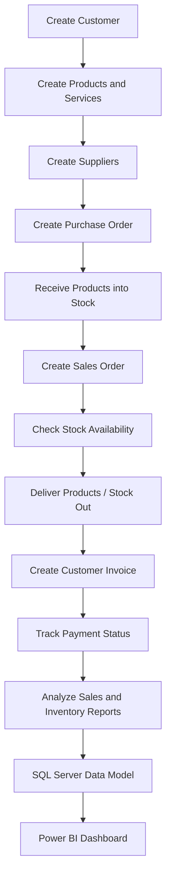

# ERP Operational Workflow

## Aurevia ERP Operations & BI Dashboard Case Study

### 1. Purpose

This document defines the end-to-end ERP operational workflow for the Aurevia ERP Operations & BI Dashboard Case Study.

The purpose is to demonstrate how a growing B2B wellness supply business can manage its core operations through an ERP system, including customer management, supplier management, product setup, purchasing, inventory, sales orders, invoicing, payment tracking, and reporting.

This workflow will be implemented in the Odoo ERP portal and later supported with SQL Server data modeling and Power BI reporting.

---

## 2. ERP Process Scope

The project covers the following ERP process areas:

| Process Area        | Business Purpose                                           | ERP Module                   |
| ------------------- | ---------------------------------------------------------- | ---------------------------- |
| Customer Management | Create and manage customer accounts                        | Contacts / CRM               |
| Supplier Management | Create and manage vendor records                           | Contacts / Purchase          |
| Product Management  | Define products, services, costs, prices, and categories   | Inventory / Sales / Purchase |
| Purchasing          | Create purchase orders for suppliers                       | Purchase                     |
| Inventory           | Track stock receipts, stock exits, and warehouse movements | Inventory                    |
| Sales               | Create sales orders for B2B customers                      | Sales                        |
| Invoicing           | Generate customer invoices from sales orders               | Invoicing / Accounting       |
| Payments            | Track paid, unpaid, partial, and overdue invoices          | Invoicing / Accounting       |
| Reporting           | Analyze operational and financial KPIs                     | Odoo Reports / Power BI      |

---

## 3. End-to-End ERP Workflow

The main ERP workflow follows this business sequence:

1. Create customer records
2. Create product and service records
3. Create supplier records
4. Create purchase orders
5. Receive purchased products into stock
6. Create sales orders
7. Deliver products and reduce stock
8. Create customer invoices
9. Track payment and collection status
10. Analyze stock and sales reports
11. Transfer ERP-related data logic into SQL Server
12. Build Power BI dashboards for management reporting

---

## 4. Workflow Diagram

---

## 5. Process 1 — Customer Creation

### Business Need

Aurevia Professional Supply needs to manage B2B customer accounts such as hotels, spa centers, clinics, beauty salons, and distributors.

### ERP Action

Create customer records in the ERP system.

### Example Customers

* Lunara Hotel & Spa
* Velora Wellness Resort
* Serene Touch Spa
* Mira Beauty Studio
* Dermaline Clinic

### Key Fields

| Field               | Description                                    |
| ------------------- | ---------------------------------------------- |
| Customer Name       | Legal or commercial name of the customer       |
| Customer Segment    | Hotel, spa, clinic, beauty salon, distributor  |
| City                | Customer location                              |
| Payment Term        | Net 15, Net 30, Net 45, Net 60                 |
| Sales Channel       | B2B Direct, Website Lead, Sales Representative |
| Contact Information | Email, phone, address                          |

### Expected Output

Customer records are created and ready to be used in sales orders, invoices, and reporting.

### Screenshot to Capture

* Customer list screen
* Customer detail screen

---

## 6. Process 2 — Product and Service Creation

### Business Need

Aurevia sells both physical products and service-based offerings. These must be defined in the ERP system with category, cost, sales price, and stock rules.

### ERP Action

Create product and service records in the ERP system.

### Example Products

* Aurevia Lavender Massage Oil 500 ml
* Aromatherapy Essential Oil Set
* Hammam Ritual Kit Premium
* Spa Towel Set
* Facial Care Professional Kit
* VIP Spa Experience Kit

### Example Services

* Spa Staff Product Training
* Wellness Operations Consulting

### Key Fields

| Field            | Description                                           |
| ---------------- | ----------------------------------------------------- |
| Product Name     | Name of the product or service                        |
| Product Type     | Product or Service                                    |
| Product Category | Massage oil, aromatherapy, textile, skincare, service |
| Unit Cost        | Purchase or production cost                           |
| Sales Price      | Customer sales price                                  |
| Reorder Level    | Minimum stock threshold                               |
| Supplier         | Default vendor where applicable                       |

### Expected Output

Products and services are ready to be used in purchase orders, sales orders, inventory movements, and sales reporting.

### Screenshot to Capture

* Product list screen
* Product detail screen
* Product category screen if available

---

## 7. Process 3 — Supplier Creation

### Business Need

Aurevia purchases products from multiple suppliers. Supplier records are required for purchase order management and supplier performance analysis.

### ERP Action

Create supplier/vendor records in the ERP system.

### Example Suppliers

* Botanica Oils Ltd.
* Natural Essence Co.
* Ege Textile Supply
* Dermalab Cosmetics
* HammamPro Supplies
* Velinor Packaging

### Key Fields

| Field               | Description               |
| ------------------- | ------------------------- |
| Supplier Name       | Vendor name               |
| Supplier Category   | Product category supplied |
| City                | Supplier location         |
| Payment Term        | Supplier payment term     |
| Contact Information | Email, phone, address     |

### Expected Output

Supplier records are ready to be used in purchase orders and supplier performance reporting.

### Screenshot to Capture

* Supplier list screen
* Supplier detail screen

---

## 8. Process 4 — Purchase Order Creation

### Business Need

Aurevia needs to replenish stock by purchasing products from suppliers.

### ERP Action

Create purchase orders for selected suppliers.

### Example Scenario

Aurevia purchases 500 units of Lavender Massage Oil from Botanica Oils Ltd.

### Key Fields

| Field                  | Description            |
| ---------------------- | ---------------------- |
| Supplier               | Selected vendor        |
| Purchase Order Date    | Date of purchase order |
| Product                | Purchased item         |
| Quantity               | Ordered quantity       |
| Unit Cost              | Purchase price         |
| Expected Delivery Date | Planned receipt date   |
| Warehouse              | Target warehouse       |

### Expected Output

A purchase order is created and confirmed. The order is ready for stock receipt.

### Screenshot to Capture

* Purchase order list
* Purchase order detail
* Purchase order confirmation status

---

## 9. Process 5 — Stock Receipt

### Business Need

Purchased products must be received into warehouse stock after supplier delivery.

### ERP Action

Receive products against the purchase order in the Inventory module.

### Key Fields

| Field             | Description               |
| ----------------- | ------------------------- |
| Purchase Order    | Related purchase order    |
| Product           | Received item             |
| Received Quantity | Quantity received         |
| Warehouse         | Receiving location        |
| Receipt Date      | Actual stock receipt date |

### Expected Output

Inventory quantity increases after receipt confirmation.

### Screenshot to Capture

* Incoming shipment / receipt screen
* Stock movement screen
* Updated product stock quantity

---

## 10. Process 6 — Sales Order Creation

### Business Need

B2B customers place product or service orders that must be tracked through the ERP system.

### ERP Action

Create sales orders for customers.

### Example Scenario

Lunara Hotel & Spa orders:

* 120 units of Aurevia Lavender Massage Oil 500 ml
* 50 units of Hammam Ritual Kit Standard
* 20 units of Spa Towel Set

### Key Fields

| Field            | Description                                    |
| ---------------- | ---------------------------------------------- |
| Customer         | Buying customer                                |
| Sales Order Date | Date of order                                  |
| Product          | Ordered product or service                     |
| Quantity         | Ordered quantity                               |
| Sales Price      | Unit sales price                               |
| Payment Term     | Customer payment condition                     |
| Sales Channel    | B2B Direct, Website Lead, Sales Representative |

### Expected Output

Sales order is created and confirmed. The order becomes ready for delivery and invoicing.

### Screenshot to Capture

* Sales order list
* Sales order detail
* Confirmed sales order status

---

## 11. Process 7 — Delivery and Stock-Out

### Business Need

After sales order confirmation, physical products must be delivered and removed from inventory.

### ERP Action

Process the delivery order and confirm stock-out.

### Key Fields

| Field              | Description            |
| ------------------ | ---------------------- |
| Sales Order        | Related customer order |
| Product            | Delivered item         |
| Delivered Quantity | Quantity shipped       |
| Warehouse          | Source warehouse       |
| Delivery Date      | Actual delivery date   |

### Expected Output

Inventory quantity decreases after delivery confirmation.

### Screenshot to Capture

* Delivery order screen
* Stock-out movement
* Updated product stock level

---

## 12. Process 8 — Invoice Creation

### Business Need

Aurevia must create customer invoices based on sales orders and delivered products/services.

### ERP Action

Generate customer invoice from the sales order.

### Key Fields

| Field               | Description                          |
| ------------------- | ------------------------------------ |
| Customer            | Invoice recipient                    |
| Invoice Date        | Date of invoice                      |
| Due Date            | Based on payment term                |
| Invoice Amount      | Total amount                         |
| Related Sales Order | Source order                         |
| Invoice Status      | Draft, posted, paid, unpaid, overdue |

### Expected Output

Customer invoice is created and becomes available for payment tracking.

### Screenshot to Capture

* Invoice list
* Invoice detail
* Invoice status

---

## 13. Process 9 — Payment Tracking

### Business Need

Finance and operations teams need to track paid, unpaid, partial, and overdue invoices.

### ERP Action

Register payments or mark invoices with open/overdue status.

### Payment Status Examples

| Status  | Description                    |
| ------- | ------------------------------ |
| Paid    | Invoice fully collected        |
| Partial | Invoice partially collected    |
| Open    | Invoice unpaid but not overdue |
| Overdue | Invoice unpaid after due date  |

### Expected Output

Payment and collection status becomes visible for reporting and management follow-up.

### Screenshot to Capture

* Payment registration screen
* Paid invoice example
* Overdue invoice example if available

---

## 14. Process 10 — ERP Reporting

### Business Need

Management needs visibility into sales performance, stock levels, supplier activity, and payment collection.

### ERP Action

Use ERP reporting screens and exported data to support further BI analysis.

### Reporting Areas

* Sales by customer
* Sales by product category
* Sales by month
* Stock on hand
* Low stock products
* Supplier purchase volume
* Open invoices
* Overdue invoices
* Payment collection status

### Expected Output

ERP operational data becomes the basis for SQL Server modeling and Power BI dashboards.

### Screenshot to Capture

* Sales report screen
* Inventory report screen
* Invoice/payment report screen

---

## 15. ERP-to-BI Reporting Logic

The ERP portal demonstrates real operational process execution.

The SQL Server layer expands this process into a larger synthetic dataset for professional-scale analytics.

The Power BI layer transforms this ERP-style data into management dashboards.

---

## 16. Business Questions Supported

This ERP workflow supports the following business questions:

* Which customer segments generate the highest revenue?
* Which products and categories are most profitable?
* Which products are below reorder level?
* Which suppliers have the highest purchase volume?
* Which invoices are overdue?
* What is the payment collection rate?
* Are sales increasing while collections are delayed?
* Which products have stock but low sales performance?
* Which sales channels bring higher-value customers?
* What are the key operational risks in inventory and receivables?

---

## 17. Portfolio Relevance

This workflow demonstrates:

* Hands-on ERP portal usage
* Understanding of sales, purchasing, inventory, invoicing, and payment processes
* Ability to translate business operations into data structures
* Process analysis mindset
* ERP-to-BI reporting logic
* Readiness to contribute to ERP support, UAT, Go-Live, and operational reporting tasks
