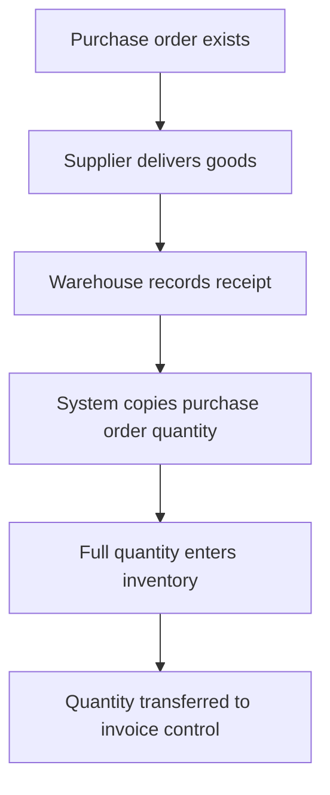
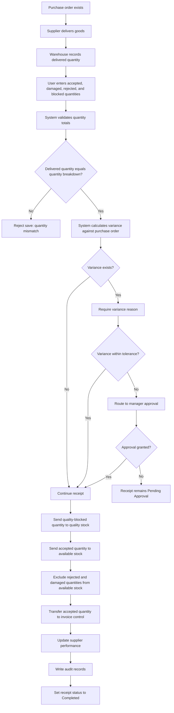

# Goods Receipt Variance and Quality Block Control

## 1. Requirement Summary

| Field | Value |
|---|---|
| Requirement ID | REQ-GR-001 |
| Module | Purchasing / Goods Receipt / Quality / Invoice Control |
| Priority | High |
| Requesting Units | Purchasing, Warehouse, Quality, Finance, Supplier Management |
| Target Environments | DEV, TEST, UAT, PROD-DEMO |
| Main Risk | Incorrect inventory, supplier liability, and invoice quantity mismatch |

The goods receipt process must record delivered, accepted, rejected, damaged, and quality-blocked quantities separately.

The system must validate quantity variances, require reason codes, apply tolerance rules, route exceptions for approval, update inventory correctly, and transfer only accepted quantities to invoice control.

---

## 2. Business Problem

The current goods receipt process may treat the full purchase order quantity as accepted even when the physical delivery contains shortages, excess quantities, damaged items, or rejected materials.

This may cause:

- Incorrect available stock
- Rejected material entering usable inventory
- Supplier performance being calculated incorrectly
- Invoice quantities exceeding accepted quantities
- Missing variance reasons
- Unapproved tolerance exceptions
- Incomplete quality traceability
- Incorrect audit history

---

## 3. AS-IS Process



### Current Gaps

| Gap ID | Current Gap | Operational Impact |
|---|---|---|
| GAP-GR-01 | Delivered and accepted quantities are not separated | Incorrect stock balance |
| GAP-GR-02 | Damaged and rejected quantities may enter available stock | Unusable material may be consumed |
| GAP-GR-03 | Variance reason is not mandatory | Missing operational evidence |
| GAP-GR-04 | Tolerance exceptions are not routed for approval | Unauthorized receipt differences |
| GAP-GR-05 | Invoice control uses the purchase order quantity | Overpayment risk |
| GAP-GR-06 | Supplier performance is not updated from receipt results | Inaccurate supplier evaluation |
| GAP-GR-07 | Quality decisions are not fully traceable | Audit and compliance risk |

---

## 4. TO-BE Process



---

## 5. Business Rules

| Rule ID | Business Rule |
|---|---|
| BR-GR-001 | Delivered quantity must equal accepted, rejected, damaged, and quality-blocked quantities combined. |
| BR-GR-002 | A variance reason is mandatory when delivered quantity differs from purchase order quantity. |
| BR-GR-003 | Quantity variance must be calculated against purchase order quantity. |
| BR-GR-004 | Variances above the configured tolerance require manager approval. |
| BR-GR-005 | Accepted quantity may enter available stock. |
| BR-GR-006 | Quality-blocked quantity must enter quality stock and remain unavailable for consumption. |
| BR-GR-007 | Rejected and damaged quantities must not enter available stock. |
| BR-GR-008 | Only accepted quantity may be transferred to invoice control. |
| BR-GR-009 | The receipt cannot be completed while approval is pending. |
| BR-GR-010 | Supplier delivery performance must be updated from the completed receipt. |
| BR-GR-011 | Every receipt, variance, approval, rejection, and quality decision must create an audit record. |
| BR-GR-012 | Duplicate receipt submission must not create duplicate inventory movements. |
| BR-GR-013 | Receipt quantity must not exceed remaining open purchase order quantity without approval. |
| BR-GR-014 | A completed receipt cannot be edited without authorized reversal. |

---

## 6. Functional Requirements

| Requirement ID | Functional Requirement | Related Rule |
|---|---|---|
| FR-GR-001 | The system must capture delivered quantity separately from accepted quantity. | BR-GR-001 |
| FR-GR-002 | The system must capture rejected, damaged, and quality-blocked quantities. | BR-GR-001 |
| FR-GR-003 | The system must validate that the quantity breakdown equals delivered quantity. | BR-GR-001 |
| FR-GR-004 | The system must require a variance reason when delivered quantity differs from purchase order quantity. | BR-GR-002 |
| FR-GR-005 | The system must calculate variance quantity and variance percentage. | BR-GR-003 |
| FR-GR-006 | The system must compare variance percentage with the configured tolerance. | BR-GR-004 |
| FR-GR-007 | The system must route tolerance exceptions to manager approval. | BR-GR-004 |
| FR-GR-008 | The system must create available inventory only from accepted quantity. | BR-GR-005 |
| FR-GR-009 | The system must create quality-blocked inventory separately. | BR-GR-006 |
| FR-GR-010 | The system must exclude rejected and damaged quantities from available inventory. | BR-GR-007 |
| FR-GR-011 | The system must transfer only accepted quantity to invoice control. | BR-GR-008 |
| FR-GR-012 | The system must prevent completion while approval is pending. | BR-GR-009 |
| FR-GR-013 | The system must update supplier performance metrics after completion. | BR-GR-010 |
| FR-GR-014 | The system must create audit records for receipt and approval actions. | BR-GR-011 |
| FR-GR-015 | The system must prevent duplicate inventory movements for the same receipt. | BR-GR-012 |
| FR-GR-016 | The system must validate the remaining open purchase order quantity. | BR-GR-013 |
| FR-GR-017 | The system must restrict completed receipt changes to authorized reversal actions. | BR-GR-014 |
| FR-GR-018 | The system must return a business error code and user message when validation fails. | BR-GR-001 to BR-GR-014 |

---

## 7. Non-Functional Requirements

| Requirement ID | Non-Functional Requirement |
|---|---|
| NFR-GR-001 | Receipt validation must complete within 2 seconds under normal test load. |
| NFR-GR-002 | Inventory movement, receipt completion, and invoice-control transfer must run in one database transaction. |
| NFR-GR-003 | A failed validation must roll back all inventory and receipt changes. |
| NFR-GR-004 | Audit records must include user, timestamp, action, receipt ID, old value, and new value. |
| NFR-GR-005 | Duplicate requests must not create duplicate inventory movements. |
| NFR-GR-006 | Users must only access actions allowed by their assigned role. |
| NFR-GR-007 | API responses must use consistent HTTP status codes and business error codes. |
| NFR-GR-008 | Receipt and approval actions must be traceable through logs and audit records. |

---

## 8. Roles and Authorization Matrix

| Action | Purchasing User | Goods Receipt User | Warehouse Manager | Quality User | Finance User | Admin |
|---|---:|---:|---:|---:|---:|---:|
| View purchase order | Yes | Yes | Yes | Yes | Yes | Yes |
| Create goods receipt | No | Yes | Yes | No | No | Yes |
| Enter quantity breakdown | No | Yes | Yes | No | No | Yes |
| Approve tolerance exception | No | No | Yes | No | No | Yes |
| Change quality status | No | No | No | Yes | No | Yes |
| Complete approved receipt | No | Yes | Yes | No | No | Yes |
| Transfer accepted quantity to invoice control | No | No | No | No | Yes | Yes |
| Reverse completed receipt | No | No | Yes | No | No | Yes |
| View audit logs | Yes | Yes | Yes | Yes | Yes | Yes |

---

## 9. Required Data Fields

### Goods Receipt

| Field | Type | Required | Validation |
|---|---|---:|---|
| receipt_id | Integer | Yes | Unique |
| receipt_number | String | Yes | Unique |
| purchase_order_id | Integer | Yes | Existing open purchase order |
| supplier_id | Integer | Yes | Must match purchase order |
| warehouse_id | Integer | Yes | Existing warehouse |
| receipt_status | String | Yes | Draft, Pending Approval, Completed, Rejected, Reversed |
| delivered_at | DateTime | Yes | Required |
| created_by | Integer | Yes | Existing active user |
| approved_by | Integer | No | Required for tolerance exception |
| completed_at | DateTime | No | Required when completed |

### Goods Receipt Item

| Field | Type | Required | Validation |
|---|---|---:|---|
| receipt_item_id | Integer | Yes | Unique |
| receipt_id | Integer | Yes | Existing receipt |
| purchase_order_item_id | Integer | Yes | Existing open order item |
| product_id | Integer | Yes | Must match purchase order item |
| batch_number | String | Yes | Required for traceable products |
| ordered_quantity | Decimal | Yes | Greater than zero |
| delivered_quantity | Decimal | Yes | Zero or greater |
| accepted_quantity | Decimal | Yes | Zero or greater |
| rejected_quantity | Decimal | Yes | Zero or greater |
| damaged_quantity | Decimal | Yes | Zero or greater |
| quality_blocked_quantity | Decimal | Yes | Zero or greater |
| variance_quantity | Calculated | Yes | delivered_quantity - ordered_quantity |
| variance_percentage | Calculated | Yes | variance_quantity / ordered_quantity × 100 |
| variance_reason_code | String | Conditional | Required when variance exists |

### Approval Record

| Field | Type | Required | Validation |
|---|---|---:|---|
| approval_id | Integer | Yes | Unique |
| entity_type | String | Yes | GOODS_RECEIPT |
| entity_id | Integer | Yes | Existing receipt |
| approval_type | String | Yes | QUANTITY_VARIANCE |
| approval_status | String | Yes | Pending, Approved, Rejected |
| requested_by | Integer | Yes | Existing user |
| approved_by | Integer | No | Required when completed |
| requested_at | DateTime | Yes | System generated |
| decision_at | DateTime | No | Required when completed |

### Inventory Movement

| Field | Type | Required | Validation |
|---|---|---:|---|
| movement_id | Integer | Yes | Unique |
| receipt_item_id | Integer | Yes | Existing receipt item |
| movement_type | String | Yes | AVAILABLE_IN, QUALITY_BLOCK_IN, REJECTED_OUT, REVERSAL |
| quantity | Decimal | Yes | Greater than zero |
| warehouse_id | Integer | Yes | Existing warehouse |
| created_at | DateTime | Yes | System generated |

---

## 10. Acceptance Criteria

### AC-GR-001 — Quantity Breakdown Validation

```gherkin
Given delivered quantity is 1000 units
And accepted quantity is 900
And rejected quantity is 50
And damaged quantity is 30
And quality-blocked quantity is 20
When the user saves the receipt
Then the total quantity breakdown must equal 1000
And the receipt may continue to the next validation
```

### AC-GR-002 — Invalid Quantity Breakdown

```gherkin
Given delivered quantity is 1000 units
And the quantity breakdown totals 980
When the user saves the receipt
Then the receipt must remain in Draft status
And the system must return error code RECEIPT_QUANTITY_MISMATCH
And no inventory movement must be created
```

### AC-GR-003 — Variance Reason Required

```gherkin
Given purchase order quantity is 1000 units
And delivered quantity is 950 units
And no variance reason is entered
When the user submits the receipt
Then the submission must be rejected
And the system must return error code VARIANCE_REASON_REQUIRED
```

### AC-GR-004 — Variance Within Tolerance

```gherkin
Given purchase order quantity is 1000 units
And delivered quantity is 980 units
And configured tolerance is 3 percent
When the user submits the receipt
Then the receipt must not require manager approval
And the receipt may continue after a variance reason is entered
```

### AC-GR-005 — Variance Above Tolerance

```gherkin
Given purchase order quantity is 1000 units
And delivered quantity is 900 units
And configured tolerance is 3 percent
When the user submits the receipt
Then the receipt status must become Pending Approval
And no inventory movement must be created before approval
```

### AC-GR-006 — Accepted Quantity to Available Stock

```gherkin
Given accepted quantity is 900 units
And all validations pass
When the receipt is completed
Then available inventory must increase by 900 units
And invoice-control quantity must equal 900 units
```

### AC-GR-007 — Quality-Blocked Quantity

```gherkin
Given quality-blocked quantity is 20 units
When the receipt is completed
Then quality stock must increase by 20 units
And available inventory must not include the blocked quantity
```

### AC-GR-008 — Rejected and Damaged Quantity

```gherkin
Given rejected quantity is 50 units
And damaged quantity is 30 units
When the receipt is completed
Then neither quantity must enter available inventory
And the receipt audit record must include both quantities
```

### AC-GR-009 — Duplicate Submission Protection

```gherkin
Given a receipt has already been completed
When the completion request is submitted again
Then no duplicate inventory movement must be created
And the system must return the existing receipt status
```

### AC-GR-010 — Completed Receipt Reversal

```gherkin
Given a completed receipt created available inventory
And the current user has reversal authority
When the user reverses the receipt
Then the original inventory movements must be reversed
And the receipt status must become Reversed
And an audit record must be created
```

---

## 11. System Messages

| Error Code | HTTP Status | User Message |
|---|---:|---|
| RECEIPT_QUANTITY_MISMATCH | 422 | Delivered quantity must equal the total quantity breakdown. |
| VARIANCE_REASON_REQUIRED | 422 | A variance reason is required for this receipt. |
| VARIANCE_APPROVAL_REQUIRED | 202 | The receipt requires manager approval. |
| PURCHASE_ORDER_CLOSED | 409 | The purchase order is closed and cannot receive additional quantity. |
| OPEN_QUANTITY_EXCEEDED | 422 | The delivered quantity exceeds the remaining open purchase order quantity. |
| DUPLICATE_RECEIPT_MOVEMENT | 409 | Inventory movements already exist for this receipt. |
| RECEIPT_NOT_APPROVED | 422 | The receipt cannot be completed before approval. |
| RECEIPT_ALREADY_COMPLETED | 409 | The receipt has already been completed. |
| RECEIPT_ALREADY_REVERSED | 409 | The receipt has already been reversed. |
| USER_NOT_AUTHORIZED | 403 | You are not authorized to perform this action. |
| RECEIPT_NOT_FOUND | 404 | The requested goods receipt was not found. |

---

## 12. API Contract

| Method | Endpoint | Purpose |
|---|---|---|
| POST | `/api/goods-receipts` | Create a draft goods receipt |
| POST | `/api/goods-receipts/:receiptId/validate` | Validate quantity breakdown and variance rules |
| POST | `/api/goods-receipts/:receiptId/submit` | Submit receipt for completion or approval |
| POST | `/api/goods-receipts/:receiptId/approve` | Approve a tolerance exception |
| POST | `/api/goods-receipts/:receiptId/complete` | Complete receipt and create inventory movements |
| POST | `/api/goods-receipts/:receiptId/reverse` | Reverse a completed receipt |
| GET | `/api/goods-receipts/:receiptId` | Return receipt details |
| GET | `/api/goods-receipts/:receiptId/movements` | Return inventory movements |
| GET | `/api/purchase-orders/:orderId/open-quantity` | Return remaining open quantity |
| GET | `/api/audit-logs` | Return receipt and approval audit records |

---

## 13. Database Validation Points

| Validation ID | Validation |
|---|---|
| DBV-GR-001 | Confirm quantity breakdown equals delivered quantity. |
| DBV-GR-002 | Confirm invalid receipt submission creates no inventory movement. |
| DBV-GR-003 | Confirm tolerance exception creates a pending approval record. |
| DBV-GR-004 | Confirm accepted quantity enters available inventory. |
| DBV-GR-005 | Confirm quality-blocked quantity enters quality stock only. |
| DBV-GR-006 | Confirm rejected and damaged quantities do not enter available inventory. |
| DBV-GR-007 | Confirm invoice-control quantity equals accepted quantity. |
| DBV-GR-008 | Confirm duplicate completion creates no duplicate movement. |
| DBV-GR-009 | Confirm reversal creates opposite inventory movements. |
| DBV-GR-010 | Confirm supplier performance is updated after completion. |
| DBV-GR-011 | Confirm receipt, approval, completion, and reversal actions create audit records. |

---

## 14. Requirement-Test Traceability

| Business Rule | Functional Requirement | Acceptance Criteria | Planned Test |
|---|---|---|---|
| BR-GR-001 | FR-GR-001, FR-GR-002, FR-GR-003 | AC-GR-001, AC-GR-002 | TC-GR-001, TC-GR-002, DBV-GR-001 |
| BR-GR-002 | FR-GR-004 | AC-GR-003 | TC-GR-003 |
| BR-GR-003 | FR-GR-005 | AC-GR-004, AC-GR-005 | TC-GR-004 |
| BR-GR-004 | FR-GR-006, FR-GR-007 | AC-GR-005 | TC-GR-005, DBV-GR-003 |
| BR-GR-005 | FR-GR-008 | AC-GR-006 | TC-GR-006, DBV-GR-004 |
| BR-GR-006 | FR-GR-009 | AC-GR-007 | TC-GR-007, DBV-GR-005 |
| BR-GR-007 | FR-GR-010 | AC-GR-008 | TC-GR-008, DBV-GR-006 |
| BR-GR-008 | FR-GR-011 | AC-GR-006 | TC-GR-009, DBV-GR-007 |
| BR-GR-009 | FR-GR-012 | AC-GR-005 | TC-GR-010 |
| BR-GR-010 | FR-GR-013 | AC-GR-006 | TC-GR-011, DBV-GR-010 |
| BR-GR-011 | FR-GR-014 | AC-GR-008, AC-GR-010 | TC-GR-012, DBV-GR-011 |
| BR-GR-012 | FR-GR-015 | AC-GR-009 | TC-GR-013, DBV-GR-008 |
| BR-GR-013 | FR-GR-016 | AC-GR-005 | TC-GR-014 |
| BR-GR-014 | FR-GR-017 | AC-GR-010 | TC-GR-015, DBV-GR-009 |

---

## 15. Definition of Done

The requirement is ready for UAT when:

- All functional requirements are implemented.
- Quantity, tolerance, approval, and inventory rules pass in TEST.
- No Critical or High severity defect remains open.
- SQL validation confirms inventory and invoice-control behavior.
- Postman tests pass for positive, negative, and authorization scenarios.
- Selected Playwright tests pass for critical UI flows.
- Regression tests confirm existing purchasing and inventory functions still work.
- UAT users, roles, and test data are available.
- Release notes and rollback steps are prepared.