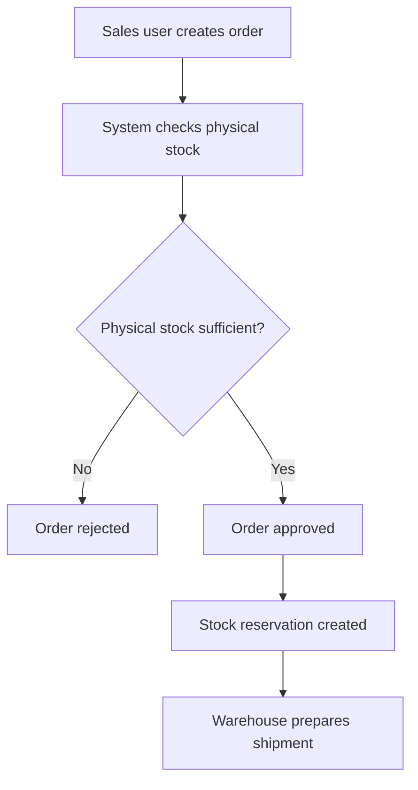
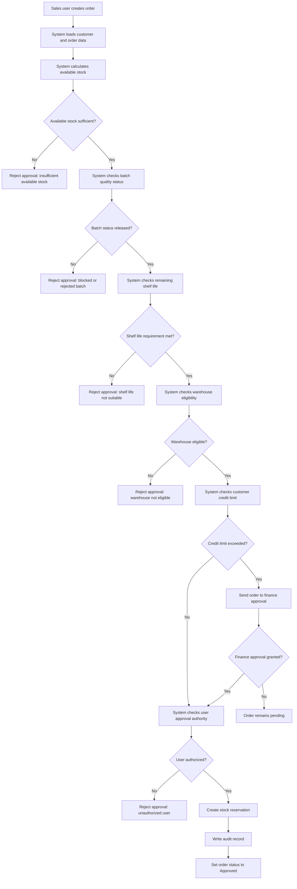

# Sales Order, Batch and Stock Reservation Control

## 1. Requirement Summary

| Field | Value |
|---|---|
| Requirement ID | REQ-SO-001 |
| Module | Sales Order / Inventory |
| Priority | High |
| Requesting Units | Sales Operations, Warehouse, Quality, Finance |
| Target Environments | DEV, TEST, UAT, PROD-DEMO |
| Main Risk | Invalid stock reservation and unsuitable batch allocation |

The sales order approval process must validate stock availability, active reservations, batch quality, remaining shelf life, warehouse eligibility, customer credit limit, and user authorization before creating a stock reservation.

---

## 2. Business Problem

The current process evaluates physical inventory but does not consistently verify whether the stock is usable for the selected customer and order.

This may cause:

- Allocation of quality-blocked batches
- Allocation of expired or short-dated batches
- Double reservation of the same stock
- Approval of orders exceeding customer credit limits
- Unauthorized order approval
- Reservations remaining active after order cancellation

---

## 3. AS-IS Process



### Current Gaps

| Gap ID | Current Gap | Operational Impact |
|---|---|---|
| GAP-01 | Active reservations are not deducted correctly | Double allocation risk |
| GAP-02 | Batch quality status is not validated | Blocked product may be shipped |
| GAP-03 | Remaining shelf life is not checked | Customer rejection and return risk |
| GAP-04 | Credit limit is not included in approval | Financial exposure |
| GAP-05 | Approval authority is not validated | Unauthorized transaction |
| GAP-06 | Cancellation may not release reservation | Incorrect available stock |

---

## 4. TO-BE Process



---

## 5. Business Rules

| Rule ID | Business Rule |
|---|---|
| BR-SO-001 | Available stock must be calculated as physical stock minus active reservations. |
| BR-SO-002 | A batch with status `QUALITY_BLOCKED`, `REJECTED`, or `EXPIRED` must not be reserved. |
| BR-SO-003 | The batch expiration date must satisfy the customer’s minimum remaining shelf-life requirement. |
| BR-SO-004 | Stock must belong to a warehouse marked as eligible for sales allocation. |
| BR-SO-005 | Orders exceeding the customer credit limit must require finance approval. |
| BR-SO-006 | Only authorized users may approve restricted sales orders. |
| BR-SO-007 | An approved order must create one active reservation per allocated batch. |
| BR-SO-008 | Cancelling an order must release all active reservations for that order. |
| BR-SO-009 | Reservation quantity must not exceed available quantity. |
| BR-SO-010 | Every approval, rejection, cancellation, and reservation action must create an audit record. |
| BR-SO-011 | A rejected approval attempt must not change stock or reservation balances. |
| BR-SO-012 | An order must not be shipped while finance approval is pending. |

---

## 6. Functional Requirements

| Requirement ID | Functional Requirement | Related Rule |
|---|---|---|
| FR-SO-001 | The system must calculate available stock before order approval. | BR-SO-001 |
| FR-SO-002 | The system must validate the selected batch quality status. | BR-SO-002 |
| FR-SO-003 | The system must calculate remaining shelf life in days. | BR-SO-003 |
| FR-SO-004 | The system must compare remaining shelf life with the customer requirement. | BR-SO-003 |
| FR-SO-005 | The system must validate warehouse eligibility. | BR-SO-004 |
| FR-SO-006 | The system must calculate the customer’s projected credit exposure after the order. | BR-SO-005 |
| FR-SO-007 | The system must route credit-limit exceptions to finance approval. | BR-SO-005 |
| FR-SO-008 | The system must validate the current user’s approval role. | BR-SO-006 |
| FR-SO-009 | The system must create a reservation only after all mandatory controls pass. | BR-SO-007 |
| FR-SO-010 | The system must release active reservations when an order is cancelled. | BR-SO-008 |
| FR-SO-011 | The system must prevent reservation quantities above available stock. | BR-SO-009 |
| FR-SO-012 | The system must create an audit record for every order status and reservation change. | BR-SO-010 |
| FR-SO-013 | The system must preserve the order in Draft or Pending status when approval fails. | BR-SO-011 |
| FR-SO-014 | The system must prevent shipment creation for orders awaiting finance approval. | BR-SO-012 |
| FR-SO-015 | The system must return a business error code and message when approval fails. | BR-SO-002 to BR-SO-012 |

---

## 7. Non-Functional Requirements

| Requirement ID | Non-Functional Requirement |
|---|---|
| NFR-SO-001 | Order validation must complete within 2 seconds under normal test load. |
| NFR-SO-002 | Reservation creation and order approval must run in a single database transaction. |
| NFR-SO-003 | A failed validation must roll back all reservation and stock changes. |
| NFR-SO-004 | Audit records must include user, timestamp, action, entity ID, old value, and new value. |
| NFR-SO-005 | API responses must use consistent HTTP status codes and business error codes. |
| NFR-SO-006 | Users must only access actions allowed by their assigned role. |
| NFR-SO-007 | Duplicate approval requests must not create duplicate reservations. |
| NFR-SO-008 | Validation results must be traceable through application logs and audit records. |

---

## 8. Roles and Authorization Matrix

| Action | Sales User | Sales Manager | Finance User | Quality User | Warehouse User | Admin |
|---|---:|---:|---:|---:|---:|---:|
| Create sales order | Yes | Yes | No | No | No | Yes |
| Edit draft order | Yes | Yes | No | No | No | Yes |
| Approve standard order | No | Yes | No | No | No | Yes |
| Approve credit exception | No | No | Yes | No | No | Yes |
| Change batch quality status | No | No | No | Yes | No | Yes |
| View inventory and reservations | Yes | Yes | Yes | Yes | Yes | Yes |
| Cancel approved order | No | Yes | No | No | No | Yes |
| Release reservation manually | No | No | No | No | No | Yes |
| View audit logs | No | Yes | Yes | Yes | Yes | Yes |

---

## 9. Required Data Fields

### Sales Order

| Field | Type | Required | Validation |
|---|---|---:|---|
| order_id | Integer | Yes | Unique |
| order_number | String | Yes | Unique |
| customer_id | Integer | Yes | Existing active customer |
| warehouse_id | Integer | Yes | Eligible warehouse |
| order_status | String | Yes | Draft, Pending Finance, Approved, Rejected, Cancelled |
| total_amount | Decimal | Yes | Greater than zero |
| created_by | Integer | Yes | Existing active user |
| approved_by | Integer | No | Required for approved orders |
| created_at | DateTime | Yes | System generated |

### Sales Order Item

| Field | Type | Required | Validation |
|---|---|---:|---|
| order_item_id | Integer | Yes | Unique |
| order_id | Integer | Yes | Existing order |
| product_id | Integer | Yes | Existing active product |
| batch_id | Integer | Yes | Released and valid batch |
| ordered_quantity | Decimal | Yes | Greater than zero |
| unit_price | Decimal | Yes | Zero or greater |

### Batch

| Field | Type | Required | Validation |
|---|---|---:|---|
| batch_id | Integer | Yes | Unique |
| batch_number | String | Yes | Unique per product |
| product_id | Integer | Yes | Existing product |
| quality_status | String | Yes | RELEASED, QUALITY_BLOCKED, REJECTED |
| production_date | Date | Yes | Before expiration date |
| expiration_date | Date | Yes | After production date |

### Inventory

| Field | Type | Required | Validation |
|---|---|---:|---|
| inventory_id | Integer | Yes | Unique |
| product_id | Integer | Yes | Existing product |
| batch_id | Integer | Yes | Existing batch |
| warehouse_id | Integer | Yes | Existing warehouse |
| physical_quantity | Decimal | Yes | Zero or greater |
| reserved_quantity | Decimal | Yes | Zero or greater |
| available_quantity | Calculated | Yes | physical_quantity - reserved_quantity |

### Customer Credit

| Field | Type | Required | Validation |
|---|---|---:|---|
| customer_id | Integer | Yes | Existing customer |
| credit_limit | Decimal | Yes | Zero or greater |
| current_exposure | Decimal | Yes | Zero or greater |
| projected_exposure | Calculated | Yes | current_exposure + order total |

### Stock Reservation

| Field | Type | Required | Validation |
|---|---|---:|---|
| reservation_id | Integer | Yes | Unique |
| order_id | Integer | Yes | Existing order |
| order_item_id | Integer | Yes | Existing order item |
| batch_id | Integer | Yes | Existing batch |
| reserved_quantity | Decimal | Yes | Greater than zero |
| reservation_status | String | Yes | ACTIVE, RELEASED, CONSUMED |
| created_at | DateTime | Yes | System generated |
| released_at | DateTime | No | Required when released |

---

## 10. Acceptance Criteria

### AC-SO-001 — Available Stock Calculation

```gherkin
Given a batch has 500 units of physical stock
And 200 units are actively reserved
When the user requests 350 units
Then the system must calculate available stock as 300 units
And the order approval must be rejected
And no new reservation must be created
```

### AC-SO-002 — Quality-Blocked Batch

```gherkin
Given the selected batch has status QUALITY_BLOCKED
When the user attempts to approve the order
Then the order must remain in Draft status
And the system must return error code BATCH_QUALITY_BLOCKED
And no active stock reservation must be created
```

### AC-SO-003 — Remaining Shelf Life

```gherkin
Given the customer requires at least 20 days of remaining shelf life
And the selected batch has 12 days of remaining shelf life
When the user attempts to approve the order
Then the approval must be rejected
And the system must return error code SHELF_LIFE_NOT_MET
```

### AC-SO-004 — Credit Limit Exception

```gherkin
Given the customer credit limit is 100000
And current exposure is 85000
And the order total is 25000
When the user submits the order for approval
Then the order status must become Pending Finance
And no stock reservation must be created before finance approval
```

### AC-SO-005 — Authorized Approval

```gherkin
Given all inventory, batch, shelf-life, warehouse, and credit controls pass
And the current user has the Sales Manager role
When the user approves the order
Then the order status must become Approved
And an active stock reservation must be created
And an audit record must be written
```

### AC-SO-006 — Unauthorized Approval

```gherkin
Given all business controls pass
And the current user has the Sales User role
When the user attempts to approve the order
Then the approval must be rejected
And the system must return error code USER_NOT_AUTHORIZED
And no reservation must be created
```

### AC-SO-007 — Order Cancellation

```gherkin
Given an approved order has an active reservation of 100 units
When an authorized user cancels the order
Then the reservation status must become RELEASED
And reserved stock must decrease by 100 units
And available stock must increase by 100 units
And an audit record must be written
```

### AC-SO-008 — Duplicate Approval Protection

```gherkin
Given an order has already been approved
And an active reservation already exists
When the approval request is submitted again
Then no duplicate reservation must be created
And the system must return the existing order status
```

---

## 11. System Messages

| Error Code | HTTP Status | User Message |
|---|---:|---|
| INSUFFICIENT_AVAILABLE_STOCK | 422 | Available stock is insufficient for the requested quantity. |
| BATCH_QUALITY_BLOCKED | 422 | The selected batch is blocked by quality control. |
| BATCH_REJECTED | 422 | The selected batch has been rejected and cannot be allocated. |
| BATCH_EXPIRED | 422 | The selected batch has expired. |
| SHELF_LIFE_NOT_MET | 422 | The selected batch does not meet the customer shelf-life requirement. |
| WAREHOUSE_NOT_ELIGIBLE | 422 | The selected warehouse is not eligible for sales allocation. |
| CREDIT_APPROVAL_REQUIRED | 202 | The order requires finance approval. |
| USER_NOT_AUTHORIZED | 403 | You are not authorized to approve this order. |
| DUPLICATE_RESERVATION | 409 | An active reservation already exists for this order item. |
| ORDER_ALREADY_CANCELLED | 409 | The order has already been cancelled. |
| ORDER_NOT_FOUND | 404 | The requested sales order was not found. |

---

## 12. API Operations

| Method | Endpoint | Purpose |
|---|---|---|
| GET | `/api/inventory/availability` | Return available stock by product, batch, and warehouse |
| GET | `/api/batches/:batchId` | Return batch quality and shelf-life information |
| POST | `/api/sales-orders` | Create a draft sales order |
| POST | `/api/sales-orders/:orderId/validate` | Run business-rule validation |
| POST | `/api/sales-orders/:orderId/approve` | Approve order and create reservation |
| POST | `/api/sales-orders/:orderId/finance-approve` | Approve credit-limit exception |
| POST | `/api/sales-orders/:orderId/cancel` | Cancel order and release reservations |
| GET | `/api/sales-orders/:orderId/reservations` | Return reservation records |
| GET | `/api/audit-logs` | Return audit records for selected entities |

---

## 13. Database Validation Points

The following database checks must be included in test execution:

| Validation ID | Validation |
|---|---|
| DBV-SO-001 | Confirm available stock equals physical stock minus active reservations. |
| DBV-SO-002 | Confirm blocked batches do not create reservation records. |
| DBV-SO-003 | Confirm approved orders create exactly one active reservation per order item. |
| DBV-SO-004 | Confirm rejected approval attempts do not change inventory balances. |
| DBV-SO-005 | Confirm cancelled orders release active reservations. |
| DBV-SO-006 | Confirm finance-pending orders do not create reservations. |
| DBV-SO-007 | Confirm duplicate approval requests do not create duplicate reservations. |
| DBV-SO-008 | Confirm approval and cancellation actions create audit records. |

---

## 14. Requirement-Test Traceability

| Business Rule | Functional Requirement | Acceptance Criteria | Planned Test |
|---|---|---|---|
| BR-SO-001 | FR-SO-001 | AC-SO-001 | TC-SO-001, DBV-SO-001 |
| BR-SO-002 | FR-SO-002 | AC-SO-002 | TC-SO-002, DBV-SO-002 |
| BR-SO-003 | FR-SO-003, FR-SO-004 | AC-SO-003 | TC-SO-003 |
| BR-SO-004 | FR-SO-005 | AC-SO-005 | TC-SO-004 |
| BR-SO-005 | FR-SO-006, FR-SO-007 | AC-SO-004 | TC-SO-005, DBV-SO-006 |
| BR-SO-006 | FR-SO-008 | AC-SO-006 | TC-SO-006 |
| BR-SO-007 | FR-SO-009 | AC-SO-005 | TC-SO-007, DBV-SO-003 |
| BR-SO-008 | FR-SO-010 | AC-SO-007 | TC-SO-008, DBV-SO-005 |
| BR-SO-009 | FR-SO-011 | AC-SO-001 | TC-SO-009 |
| BR-SO-010 | FR-SO-012 | AC-SO-005, AC-SO-007 | TC-SO-010, DBV-SO-008 |
| BR-SO-011 | FR-SO-013 | AC-SO-002, AC-SO-003 | TC-SO-011, DBV-SO-004 |
| BR-SO-012 | FR-SO-014 | AC-SO-004 | TC-SO-012, DBV-SO-006 |

---

## 15. Definition of Done

The requirement is ready for UAT when:

- All functional requirements are implemented.
- All mandatory business rules pass in TEST.
- No Critical or High severity defect remains open.
- SQL validation confirms correct reservation and inventory behavior.
- Postman tests pass for positive, negative, and authorization scenarios.
- Selected Playwright tests pass for critical UI flows.
- Regression tests confirm that order creation and cancellation still work.
- UAT users and test data are available.
- Release notes and rollback steps are prepared.